# Python-labs


## Лабораторная работа 1

### Задание 1
```python
a,b= input(), int(input())
print(f'Имя: {a}\nВозраст: {b}\nПривет, {a}! Через год тебе будет {b+1}.')
```
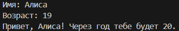

### Задание 2
```python
a,b=input(),input()
if ',' in a:
    a=a.replace(',','.')
if ',' in b:
    b=b.replace(',','.')
print(a,b)
print(f'a: {float(a)}\nb: {float(b)}\nsum: {round(float(a)+float(b),2)}\navg: {round((float(a)+float(b))/2,2)}')
```
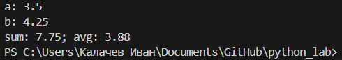

### Задание 3
```python
price, discount, vat = float(input()), float(input()), float(input())

base = price * (1 - discount / 100)
vat_amount = base * (vat / 100)
total = base + vat_amount

print(f'База после скидки: {base:.2f}')
print(f'НДС:               {vat_amount:.2f}')
print(f'Итого к оплате:    {total:.2f}')
```
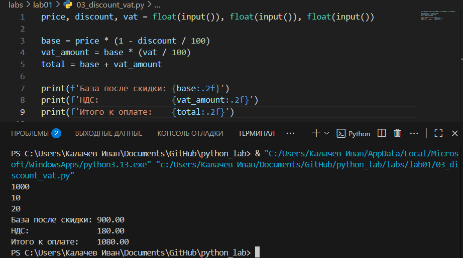


### Задание 4
```python
min_all = int(input('Минуты: '))
hour=min_all//60
min=min_all-hour*60
days=0
if hour>=24:
    days=hour//24
    hour-=days*24
print(f'Дней: {days} ЧЧ:ММ - {hour:02d}:{min:02d}')
```
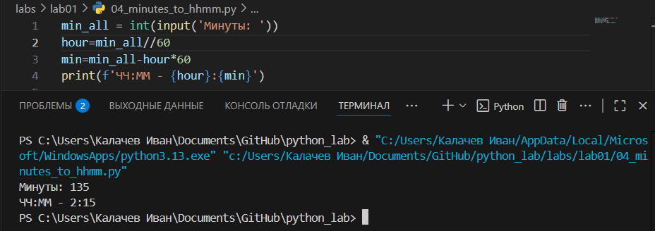

### Задание 5
```python
fio = input()
fio_apart = fio.strip()
words = fio_apart.split()
initials = "".join([word[0].upper() for word in words])
print(f'Инициалы: {initials}')
fio_full = fio_apart.replace(' ','')
print(f'Длина (символов): {len(fio_full)+2}')
```
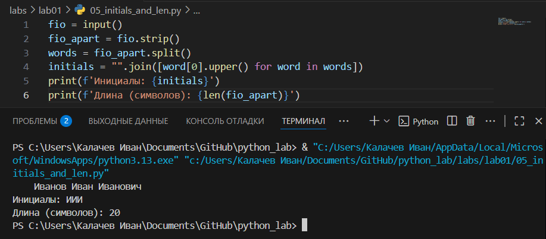


## Лабораторная работа 2

### Задание 1(a)
```python
def min_max(nums: list[float | int]) -> tuple[float | int, float | int]:
    try:
        return tuple([min(nums), max(nums)])
    except ValueError:
        return 'ValueError'
    
print(' ')
print('min max')
print(min_max([3, -1, 5, 5, 0]))
print(min_max([42]))
print(min_max([-5, -2, -9]))
print(min_max([]))
print(min_max([1.5, 2, 2.0, -3.1]))

```
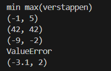

### Задание 1(b)
```python
def unique_sorted(nums: list[float | int]) -> list[float | int]:
    return sorted(list(set(nums)))

print(' ')
print('unique sorted')
print(unique_sorted([3, 1, 2, 1, 3]))
print(unique_sorted([]))
print(unique_sorted([-1, -1, 0, 2, 2]))
print(unique_sorted([1.0, 1, 2.5, 2.5, 0]))
```


### Задание 1(c)
```python
def flatten(mat: list[list | tuple]) -> list:
    final = list()
    for i in range(len(mat)):
        if type(mat[i]) == list or type(mat[i]) == tuple:
            for j in mat[i]:
                final.append(j)
        else:
            return 'TypeError'
    return final  

print(' ')
print('flatten')
print(flatten([[1, 2], [3, 4]]))
print(flatten(([1, 2], (3, 4, 5))))
print(flatten([[1], [], [2, 3]]))
print(flatten([[1, 2], "ab"]))
```
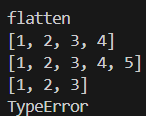

### Задание 2(a)
```python
def transpose(mat: list[list[float | int]]) -> list[list]:
    if not mat:
        return []
    
    row_len = len(mat[0])
    for row in mat:
        if len(row) != row_len:
            return 'ValueError'
    
    return [[mat[r][c] for r in range(len(mat))] for c in range(row_len)]

print('transpose')
print(transpose([[1], [2], [3]]))
print(transpose([[1, 2], [3, 4]]))
print(transpose([]))
print(transpose([[1, 2], [3]]))
```
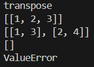

### Задание 2(b)
```python
def row_sums(mat: list[list[float | int]]) -> list[float]:
    if not mat:
        return []
    
    row_len = len(mat[0])
    for row in mat:
        if len(row) != row_len:
            return 'ValueError'
        
    return [sum(i) for i in mat]

print(' ')
print('row_sum')
print(row_sums([[1, 2, 3], [4, 5, 6]]))
print(row_sums([[-1, 1], [10, -10]]))
print(row_sums([[0, 0], [0, 0]]))
print(row_sums([[1, 2], [3]]))
```
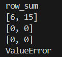

### Задание 2(c)
```python
def col_sums(mat: list[list[float | int]]) -> list[float]:
    if not mat:
        return []
    
    row_len = len(mat[0])
    for row in mat:
        if len(row) != row_len:
            return 'ValueError'
    
    mat = transpose(mat)  
    return [sum(i) for i in mat]

print(' ')
print('col_sums')
print(col_sums([[1, 2, 3], [4, 5, 6]]))
print(col_sums([[-1, 1], [10, -10]]))
print(col_sums([[0, 0], [0, 0]]))
print(col_sums([[1, 2], [3]]))
```
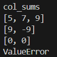

### Задание 3
```python
def info(fio: str, group: str, gpa: float) -> tuple:

    if not isinstance(fio, str):
        raise TypeError("fio должно быть строкой")
    if not isinstance(group, str):
        raise TypeError("group должно быть строкой")
    if not isinstance(gpa, (float, int)):
        raise TypeError("gpa должно быть числом")
    
    parts = [x.capitalize() for x in fio.strip().split() if x]

    if len(parts) == 3:
        form_fio = f"{parts[0]} {parts[1][0].upper()}.{parts[2][0].upper()}."
    else:
        form_fio = f"{parts[0]} {parts[1][0].upper()}."
    form_gpa = f"{gpa:.2f}"
    return (form_fio, group, form_gpa)


def format_record(rec: tuple[str, str, float]) -> str:
    fio, group, gpa = rec
    inf = info(fio, group, gpa)
    answer = ''
    for _ in inf:
        answer += str(_)+ ', '
    return answer[:-2]


print('format_record')
print(format_record(("Иванов Иван Иванович", "BIVT-25", 4.6)))
print(format_record(("Петров Пётр", "IKBO-12", 5.0)))
print(format_record(("Петров Пётр Петрович", "IKBO-12", 5.0)))
print(format_record(("  сидорова  анна   сергеевна ", "ABB-01", 3.999)))
```
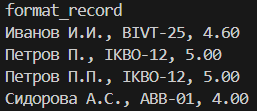

## Лабораторная работа 3

### Задание 1
```python
import re

def normalize(text: str, *, casefold: bool = True, yo2e: bool = True) -> str:
    text = re.sub(r"[\x00-\x1F\x7F]+", " ", text) #перебирает ASCII символы с кодами от 0 до 31, 127
    text = text.casefold() if casefold else text 
    text = re.sub(r"\s+", " ", text.strip())
    text = text.replace("ё", "е") if yo2e else text
    return text

def tokenize(text: str) -> list[str]:
    allowed_chars = 'a-zA-Zа-яёА-ЯЯЁ0-9- '
    text = re.sub(f'[^{allowed_chars}]', ' ', text)
    text = text.strip()
    text = re.sub(r'\s+', ' ', text)
    return text.split()

def count_freq(tokens: list[str]) -> dict[str, int]:
    counts = {}
    for tok in tokens:
        counts[tok] = counts.get(tok, 0) + 1 #функция задаёт ключу словаря значение, сначала считает их количество в словаре,а потом добавляет к нему 1 и сохраняет в словаре
    return counts

def top_n(freq: dict[str, int], n: int = 2) -> list[tuple[str, int]]:
    words = list(sorted(freq.items(), key = lambda x: (-x[1], x[0])))[:n]
    return words


# normalize
assert normalize("ПрИвЕт\nМИр\t") == "привет мир"
assert normalize("ёжик, Ёлка") == "ежик, елка"

# tokenize
assert tokenize("привет, мир!") == ["привет", "мир"]
assert tokenize("по-настоящему круто") == ["по-настоящему", "круто"]
assert tokenize("2025 год") == ["2025", "год"]

# count_freq + top_n
freq = count_freq(["a","b","a","c","b","a"])
assert freq == {"a":3, "b":2, "c":1}
assert top_n(freq, 2) == [("a",3), ("b",2)]

# тай-брейк по слову при равной частоте
freq2 = count_freq(["bb","aa","bb","aa","cc"])
assert top_n(freq2, 2) == [("aa",2), ("bb",2)]

import sys
print(sys.path)

```


### Задание 2
```python
import sys
from text import normalize, tokenize, count_freq, top_n
text = sys.stdin.read()
norm = normalize(text)
token = tokenize(norm)
cf = count_freq(token)
tn = top_n(cf, 5)
print(f"Всего слов: {len(token)}")
print(f"Уникальных слов: {len(set(token))}")
print('Топ 5:')
for word, value in tn:
    print(f'{word}: {value}')
```
