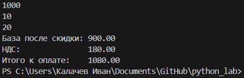

# Python-labs


## Лабораторная работа 1

### Задание 1
```python
a,b= input(), int(input())
print(f'Имя: {a}\nВозраст: {b}\nПривет, {a}! Через год тебе будет {b+1}.')
```


### Задание 2
```python
a,b=input(),input()
if ',' in a:
    a=a.replace(',','.')
if ',' in b:
    b=b.replace(',','.')
print(a,b)
print(f'a: {float(a)}\nb: {float(b)}\nsum: {round(float(a)+float(b),2)}\navg: {round((float(a)+float(b))/2,2)}')
```


### Задание 3
```python
price, discount, vat = float(input()), float(input()), float(input())

base = price * (1 - discount / 100)
vat_amount = base * (vat / 100)
total = base + vat_amount

print(f'База после скидки: {base:.2f}')
print(f'НДС:               {vat_amount:.2f}')
print(f'Итого к оплате:    {total:.2f}')
```



### Задание 4
```python
min_all = int(input('Минуты: '))
hour=min_all//60
min=min_all-hour*60
days=0
if hour>=24:
    days=hour//24
    hour-=days*24
print(f'Дней: {days} ЧЧ:ММ - {hour:02d}:{min:02d}')
```


### Задание 5
```python
fio = input()
fio_apart = fio.strip()
words = fio_apart.split()
initials = "".join([word[0].upper() for word in words])
print(f'Инициалы: {initials}')
fio_full = fio_apart.replace(' ','')
print(f'Длина (символов): {len(fio_full)+2}')
```


## Лабораторная работа 2

### Задание 1(a)
```python
def min_max(nums: list[float | int]) -> tuple[float | int, float | int]:
    try:
        return tuple([min(nums), max(nums)])
    except ValueError:
        return 'ValueError'
    
print(' ')
print('min max')
print(min_max([3, -1, 5, 5, 0]))
print(min_max([42]))
print(min_max([-5, -2, -9]))
print(min_max([]))
print(min_max([1.5, 2, 2.0, -3.1]))

```


### Задание 1(b)
```python
def unique_sorted(nums: list[float | int]) -> list[float | int]:
    return sorted(list(set(nums)))

print(' ')
print('unique sorted')
print(unique_sorted([3, 1, 2, 1, 3]))
print(unique_sorted([]))
print(unique_sorted([-1, -1, 0, 2, 2]))
print(unique_sorted([1.0, 1, 2.5, 2.5, 0]))
```


### Задание 1(c)
```python
def flatten(mat: list[list | tuple]) -> list:
    final = list()
    for i in range(len(mat)):
        if type(mat[i]) == list or type(mat[i]) == tuple:
            for j in mat[i]:
                final.append(j)
        else:
            return 'TypeError'
    return final  

print(' ')
print('flatten')
print(flatten([[1, 2], [3, 4]]))
print(flatten(([1, 2], (3, 4, 5))))
print(flatten([[1], [], [2, 3]]))
print(flatten([[1, 2], "ab"]))
```
