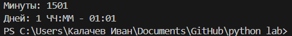
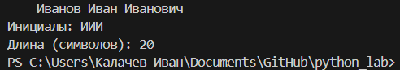
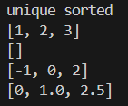
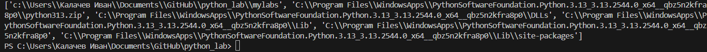

# Python-labs


## Лабораторная работа 1

### Задание 1
```python
a,b= input(), int(input())
print(f'Имя: {a}\nВозраст: {b}\nПривет, {a}! Через год тебе будет {b+1}.')
```


### Задание 2
```python
a,b=input(),input()
if ',' in a:
    a=a.replace(',','.')
if ',' in b:
    b=b.replace(',','.')
print(a,b)
print(f'a: {float(a)}\nb: {float(b)}\nsum: {round(float(a)+float(b),2)}\navg: {round((float(a)+float(b))/2,2)}')
```


### Задание 3
```python
price, discount, vat = float(input()), float(input()), float(input())

base = price * (1 - discount / 100)
vat_amount = base * (vat / 100)
total = base + vat_amount

print(f'База после скидки: {base:.2f}')
print(f'НДС:               {vat_amount:.2f}')
print(f'Итого к оплате:    {total:.2f}')
```


### Задание 4
```python
min_all = int(input('Минуты: '))
hour=min_all//60
min=min_all-hour*60
days=0
if hour>=24:
    days=hour//24
    hour-=days*24
print(f'Дней: {days} ЧЧ:ММ - {hour:02d}:{min:02d}')
```


### Задание 5
```python
fio = input()
fio_apart = fio.strip()
words = fio_apart.split()
initials = "".join([word[0].upper() for word in words])
print(f'Инициалы: {initials}')
fio_full = fio_apart.replace(' ','')
print(f'Длина (символов): {len(fio_full)+2}')
```



## Лабораторная работа 2

### Задание 1(a)
```python
def min_max(nums: list[float | int]) -> tuple[float | int, float | int]:
    try:
        return tuple([min(nums), max(nums)])
    except ValueError:
        return 'ValueError'
    
print(' ')
print('min max')
print(min_max([3, -1, 5, 5, 0]))
print(min_max([42]))
print(min_max([-5, -2, -9]))
print(min_max([]))
print(min_max([1.5, 2, 2.0, -3.1]))

```


### Задание 1(b)
```python
def unique_sorted(nums: list[float | int]) -> list[float | int]:
    return sorted(list(set(nums)))

print(' ')
print('unique sorted')
print(unique_sorted([3, 1, 2, 1, 3]))
print(unique_sorted([]))
print(unique_sorted([-1, -1, 0, 2, 2]))
print(unique_sorted([1.0, 1, 2.5, 2.5, 0]))
```


### Задание 1(c)
```python
def flatten(mat: list[list | tuple]) -> list:
    final = list()
    for i in range(len(mat)):
        if type(mat[i]) == list or type(mat[i]) == tuple:
            for j in mat[i]:
                final.append(j)
        else:
            return 'TypeError'
    return final  

print(' ')
print('flatten')
print(flatten([[1, 2], [3, 4]]))
print(flatten(([1, 2], (3, 4, 5))))
print(flatten([[1], [], [2, 3]]))
print(flatten([[1, 2], "ab"]))
```


### Задание 2(a)
```python
def transpose(mat: list[list[float | int]]) -> list[list]:
    if not mat:
        return []
    
    row_len = len(mat[0])
    for row in mat:
        if len(row) != row_len:
            return 'ValueError'
    
    return [[mat[r][c] for r in range(len(mat))] for c in range(row_len)]

print('transpose')
print(transpose([[1], [2], [3]]))
print(transpose([[1, 2], [3, 4]]))
print(transpose([]))
print(transpose([[1, 2], [3]]))
```


### Задание 2(b)
```python
def row_sums(mat: list[list[float | int]]) -> list[float]:
    if not mat:
        return []
    
    row_len = len(mat[0])
    for row in mat:
        if len(row) != row_len:
            return 'ValueError'
        
    return [sum(i) for i in mat]

print(' ')
print('row_sum')
print(row_sums([[1, 2, 3], [4, 5, 6]]))
print(row_sums([[-1, 1], [10, -10]]))
print(row_sums([[0, 0], [0, 0]]))
print(row_sums([[1, 2], [3]]))
```


### Задание 2(c)
```python
def col_sums(mat: list[list[float | int]]) -> list[float]:
    if not mat:
        return []
    
    row_len = len(mat[0])
    for row in mat:
        if len(row) != row_len:
            return 'ValueError'
    
    mat = transpose(mat)  
    return [sum(i) for i in mat]

print(' ')
print('col_sums')
print(col_sums([[1, 2, 3], [4, 5, 6]]))
print(col_sums([[-1, 1], [10, -10]]))
print(col_sums([[0, 0], [0, 0]]))
print(col_sums([[1, 2], [3]]))
```


### Задание 3
```python
def info(fio: str, group: str, gpa: float) -> tuple:

    if not isinstance(fio, str):
        raise TypeError("fio должно быть строкой")
    if not isinstance(group, str):
        raise TypeError("group должно быть строкой")
    if not isinstance(gpa, (float, int)):
        raise TypeError("gpa должно быть числом")
    
    parts = [x.capitalize() for x in fio.strip().split() if x]

    if len(parts) == 3:
        form_fio = f"{parts[0]} {parts[1][0].upper()}.{parts[2][0].upper()}."
    else:
        form_fio = f"{parts[0]} {parts[1][0].upper()}."
    form_gpa = f"{gpa:.2f}"
    return (form_fio, group, form_gpa)


def format_record(rec: tuple[str, str, float]) -> str:
    fio, group, gpa = rec
    inf = info(fio, group, gpa)
    answer = ''
    for _ in inf:
        answer += str(_)+ ', '
    return answer[:-2]


print('format_record')
print(format_record(("Иванов Иван Иванович", "BIVT-25", 4.6)))
print(format_record(("Петров Пётр", "IKBO-12", 5.0)))
print(format_record(("Петров Пётр Петрович", "IKBO-12", 5.0)))
print(format_record(("  сидорова  анна   сергеевна ", "ABB-01", 3.999)))
```


## Лабораторная работа 3

### Задание 1
```python
import re

def normalize(text: str, *, casefold: bool = True, yo2e: bool = True) -> str:
    text = re.sub(r"[\x00-\x1F\x7F]+", " ", text) 
    text = text.casefold() if casefold else text 
    text = re.sub(r"\s+", " ", text.strip())
    text = text.replace("ё", "е") if yo2e else text
    return text

def tokenize(text: str) -> list[str]:
    allowed_chars = 'a-zA-Zа-яёА-ЯЯЁ0-9- '
    text = re.sub(f'[^{allowed_chars}]', ' ', text)
    text = text.strip()
    text = re.sub(r'\s+', ' ', text)
    return text.split()

def count_freq(tokens: list[str]) -> dict[str, int]:
    counts = {}
    for tok in tokens:
        counts[tok] = counts.get(tok, 0) + 1 
    return counts

def top_n(freq: dict[str, int], n: int = 2) -> list[tuple[str, int]]:
    words = list(sorted(freq.items(), key = lambda x: (-x[1], x[0])))[:n]
    return words


# normalize
assert normalize("ПрИвЕт\nМИр\t") == "привет мир"
assert normalize("ёжик, Ёлка") == "ежик, елка"

# tokenize
assert tokenize("привет, мир!") == ["привет", "мир"]
assert tokenize("по-настоящему круто") == ["по-настоящему", "круто"]
assert tokenize("2025 год") == ["2025", "год"]

# count_freq + top_n
freq = count_freq(["a","b","a","c","b","a"])
assert freq == {"a":3, "b":2, "c":1}
assert top_n(freq, 2) == [("a",3), ("b",2)]

# тай-брейк по слову при равной частоте
freq2 = count_freq(["bb","aa","bb","aa","cc"])
assert top_n(freq2, 2) == [("aa",2), ("bb",2)]

import sys
print(sys.path)

```


### Задание 2
```python
import sys
from text import normalize, tokenize, count_freq, top_n
text = sys.stdin.read()
norm = normalize(text)
token = tokenize(norm)
cf = count_freq(token)
tn = top_n(cf, 5)
print(f"Всего слов: {len(token)}")
print(f"Уникальных слов: {len(set(token))}")
print('Топ 5:')
for word, value in tn:
    print(f'{word}: {value}')
```


## Лабораторная работа 4

### Задание 1
```python
import csv
from pathlib import Path
from typing import Iterable, Sequence

def read_text(path: str | Path, encoding: str = "utf-8") -> str:
    p = Path(path)
    return p.read_text(encoding=encoding)

def write_csv(rows: Iterable[Sequence], path: str | Path,
              header: tuple[str, ...] | None = None) -> None:
    p = Path(path)
    rows = list(rows)
    if rows:
        first_len = len(rows[0])
        if any(len(row) != first_len for row in rows):
            raise ValueError("Все строки должны иметь одинаковую длину")
    with p.open("w", newline="", encoding="utf-8") as f:
        w = csv.writer(f)
        if header is not None:
            w.writerow(header)
        for r in rows:
            w.writerow(r)
print(read_text(r"C:\Users\Калачев Иван\Documents\GitHub\python_lab\data\lab04\input.txt"))
write_csv([("word","count"),("test",3)], r"C:\Users\Калачев Иван\Documents\GitHub\python_lab\data\lab04\check.csv")
```


### Задание 2
```python
import sys
sys.path.append(r'C:\Users\Калачев Иван\Documents\GitHub\python_lab\lаbs')  
from mylabs.text import normalize, tokenize, top_n, count_freq 
from lab04.io_txt_csv import read_text, write_csv

def main():
    input_text = read_text(r'C:\Users\Калачев Иван\Documents\GitHub\python_lab\data\lab04\input.txt')
    tokens = tokenize(normalize(input_text))
    freq = count_freq(tokens)
    top_5 = top_n(freq, 5)
    top_all = top_n(freq)
    
    print(f"Всего слов: {len(tokens)}")
    print(f"Уникальных слов: {len(freq)}")
    print("Топ-5:")
    for word, count in top_5:
        print(f"{word}: {count}")
    
    write_csv(top_all, 
              path = r'data\lab04\report.csv', 
              header = ('word', 'count'))

if __name__ == "__main__":
    main()
```


## Лабортарная работа 5

### Задание 1
```python
import csv
import json
import os

def json_to_csv(json_path: str, csv_path: str) -> None: 
    if not os.path.exists(json_path):
        raise FileNotFoundError(f'Файл не найден: {json_path}')
    if os.path.getsize(json_path) == 0:
        raise ValueError('Файл пустой')
    with open(json_path,'r',encoding='utf-8') as json_file:
        json_data = json.load(json_file)
        if not isinstance(json_data,list):
            raise ValueError('Json файл не является списком')
        if not(all(isinstance(x,dict) for x in json_data)):
            raise ValueError('Данные json файла не являются словарями')
        keys = set()
        for items in json_data:
            keys.update(items.keys())
        x = sorted(keys)
        with open(csv_path,'w',newline='',encoding='utf-8') as csv_file:
            writer = csv.DictWriter(csv_file,fieldnames=x)
            writer.writeheader()
            writer.writerows(json_data)

def csv_to_json(csv_path: str, json_path: str) -> None:
    if not os.path.exists(csv_path):
        raise FileNotFoundError(f'Файл не найден: {csv_path}')
    if os.path.getsize(csv_path) == 0:
        raise ValueError('Файл полностью пуст')
    try:
        with open(csv_path,'r',encoding='utf-8') as csv_file:
            csv_data = csv.DictReader(csv_file)

            if not csv_data.fieldnames:
                raise ValueError('В файле нет заголовка')
            
            row_l = list(csv_data)
            if len(row_l) == 0:
                raise ValueError('Файл не содержит никаких данных')
    except Exception as e:
            raise ValueError(f'Ошибка: {e}')
    with open(json_path,'w',encoding='utf-8') as json_file:
        json.dump(row_l,json_file,ensure_ascii=False,indent=2)
csv_to_json(r"C:\Users\Калачев Иван\Documents\GitHub\python_lab\data\samples\people.csv",
            r"C:\Users\Калачев Иван\Documents\GitHub\python_lab\data\out\people_from_csv.json")
json_to_csv(r"C:\Users\Калачев Иван\Documents\GitHub\python_lab\data\samples\people.json",
            r"C:\Users\Калачев Иван\Documents\GitHub\python_lab\data\out\people_from_json.csv" )
```


### Задание 2
```python
import os
import csv
from openpyxl import Workbook

def csv_to_xlsx(csv_path: str, xlsx_path: str) -> None:
    if not os.path.exists(csv_path):
        raise FileNotFoundError(f'Файл не найден: {csv_path}')
    if os.path.getsize(csv_path) == 0:
        raise ValueError('Файл полностью пуст')
    
    wb = Workbook()
    ws = wb.active
    ws.title = "Sheet1"

    with open(csv_path, "r", encoding="utf-8") as csv_file: 
        reader = csv.reader(csv_file)
        for row in reader:
            ws.append(row)

    for column_cells in ws.columns:
        max_length = 0
        column_l = column_cells[0].column_letter
        for cell in column_cells:
            if cell.value:
                max_length = max(max_length, len(str(cell.value)))
        ws.column_dimensions[column_l].width = max(max_length + 2, 8)
    wb.save(xlsx_path)
csv_to_xlsx(r"C:\Users\Калачев Иван\Documents\GitHub\python_lab\data\samples\citties.csv",
            r"C:\Users\Калачев Иван\Documents\GitHub\python_lab\data\out\people.xlsx")
```


## Лабортарная работа 6

### Задание 1
```python
import argparse
import sys
from pathlib import Path

sys.path.append(str(Path(__file__).parent.parent))

from lab05.json_csv import json_to_csv, csv_to_json
from lab05.csv_xlsx import csv_to_xlsx
def main():
    parser = argparse.ArgumentParser(description="Конвертеры данных")
    sub = parser.add_subparsers(dest="cmd")
    p1 = sub.add_parser("json2csv")
    p1.add_argument("--in", dest="input", required=True)
    p1.add_argument("--out", dest="output", required=True)
    p2 = sub.add_parser("csv2json")
    p2.add_argument("--in", dest="input", required=True)
    p2.add_argument("--out", dest="output", required=True)
    p3 = sub.add_parser("csv2xlsx")
    p3.add_argument("--in", dest="input", required=True)
    p3.add_argument("--out", dest="output", required=True)
    args = parser.parse_args()
    if args.cmd == "json2csv":
        json_to_csv(args.input, args.output)
        print(f"Успешно: {args.input} -> {args.output}")
    elif args.cmd == "csv2json":
        csv_to_json(args.input, args.output)
        print(f"Успешно: {args.input} -> {args.output}")
    elif args.cmd == "csv2xlsx":
        csv_to_xlsx(args.input, args.output)
        print(f"Успешно: {args.input} -> {args.output}")
    else:
        print("Ошибка: неизвестная команда")

if __name__ == "__main__":
    main()


'''
json2csv:
python lаbs\lab06\cli_converter.py json2csv --in data/samples/people.json --out data/out/people.csv

csv2json:
python lаbs\lab06\cli_converter.py csv2json --in data/samples/people.csv --out data/out/people.json

csv2xlsx:
python lаbs\lab06\cli_converter.py csv2xlsx --in data/samples/people.csv --out data/out/people.xlsx
'''
```


### Задание 2
```python
import argparse
import sys
from pathlib import Path

def main():
    parser = argparse.ArgumentParser(description="CLI‑утилиты лабораторной №6")
    subparsers = parser.add_subparsers(dest="command")
    
    cat_parser = subparsers.add_parser("cat", help="Вывести содержимое файла")
    cat_parser.add_argument("--input", required=True)
    cat_parser.add_argument("-n", action="store_true", help="Нумеровать строки")

    stats_parser = subparsers.add_parser("stats", help="Частоты слов")
    stats_parser.add_argument("--input", required=True)
    stats_parser.add_argument("--top", type=int, default=5)

    args = parser.parse_args()

    if args.command == "cat":
        try:
            with open(args.input, 'r', encoding='utf-8') as f:
                for i, line in enumerate(f, 1):
                    if args.n:
                        print(f"{i:4} {line.rstrip()}")
                    else:
                        print(line.rstrip())
        except FileNotFoundError:
            print(f"Ошибка: файл {args.input} не найден")
            sys.exit(1)
            
    elif args.command == "stats":
        try:
            sys.path.append(str(Path(__file__).parent.parent))
            from mylabs.text import normalize, tokenize, count_freq, top_n
            
            with open(args.input, 'r', encoding='utf-8') as f:
                text = f.read()
            
            tokens = tokenize(normalize(text))
            freq = count_freq(tokens)
            top_words = top_n(freq, args.top)
            
            print(f"Всего слов: {len(tokens)}")
            print(f"Уникальных слов: {len(freq)}")
            print(f"Топ-{args.top}:")
            for word, count in top_words:
                print(f"{word}: {count}")
                
        except FileNotFoundError:
            print(f"Ошибка: файл {args.input} не найден")
            sys.exit(1)

if __name__ == "__main__":
    main()

'''
cat:
python lаbs\lab06\cli_text.py cat --input data/samples/people.csv -n

stats:
python lаbs\lab06\cli_text.py stats --input data/samples/text.txt --top 5
'''
```


## Лабортарная работа 7

### Задание 1
```python
import sys
import os
import pytest

sys.path.insert(0, os.path.join(os.path.dirname(__file__), ".."))

from lаbs.mylabs.text import normalize, tokenize, count_freq, top_n


class TestText:

    @pytest.mark.parametrize(
        "input_text, expected",
        [
            ("Hello world", "hello world"),
            (" PYTHON  Programming  ", "python programming"),
            ("Test123", "test123"),
            ("", ""),
            ("  ", ""),
            ("Hello!!??", "hello!!??"),
            ("Привет Мир", "привет мир"),
            ("café", "café"),
        ],
    )
    def test_normalize(self, input_text, expected):
        assert normalize(input_text) == expected

    @pytest.mark.parametrize(
        "input_text, expected",
        [
            ("Hello world", ["hello", "world"]),
            ("hello, world!", ["hello", "world"]),
            ("Привет мир", ["привет", "мир"]),
        ],
    )
    def test_tokenize(self, input_text, expected):
        normalized_text = normalize(input_text)
        assert tokenize(normalized_text) == expected

    @pytest.mark.parametrize(
        "tokens, expected",
        [
            (["hello", "world", "hello"], {"hello": 2, "world": 1}),
            ([], {}),
            (["a", "b", "a", "c", "c"], {"a": 2, "b": 1, "c": 2}),
        ],
    )
    def test_count_freq(self, tokens, expected):
        assert count_freq(tokens) == expected

    @pytest.mark.parametrize(
        "freq, n, expected",
        [
            ({"hello": 2, "world": 1}, 1, [("hello", 2)]),
            ({"a": 2, "b": 2, "c": 1}, 2, [("a", 2), ("b", 2)]),
            ({"x": 3, "y": 3, "z": 3}, 3, [("x", 3), ("y", 3), ("z", 3)]),
            ({}, 1, []),
        ],
    )
    def test_top_n(self, freq, n, expected):
        assert top_n(freq, n) == expected

'''
```


### Задание 2
```python
import json
import csv
import pytest
from pathlib import Path
import sys
import os

sys.path.insert(0, os.path.join(os.path.dirname(__file__), ".."))

# Импортируем из корневой папки
from lаbs.lab05.json_csv import json_to_csv, csv_to_json


def test_json_to_csv_roundtrip(tmp_path: Path):
    src = tmp_path / "people.json"
    dst = tmp_path / "people.csv"
    data = [
        {"name": "Alice", "age": 22},
        {"name": "Bob", "age": 25},
    ]
    src.write_text(json.dumps(data, ensure_ascii=False, indent=2), encoding="utf-8")
    json_to_csv(str(src), str(dst))

    with dst.open(encoding="utf-8") as f:
        rows = list(csv.DictReader(f))
    assert len(rows) == len(data)
    assert {"name", "age"} <= set(rows[0].keys())


def test_csv_to_json_roundtrip(tmp_path: Path):
    src = tmp_path / "people.csv"
    dst = tmp_path / "people_out.json"
    rows = [
        {"name": "Alice", "age": "22"},
        {"name": "Bob", "age": "25"},
    ]
    with src.open("w", encoding="utf-8", newline="") as f:
        writer = csv.DictWriter(f, fieldnames=["name", "age"])
        writer.writeheader()
        writer.writerows(rows)

    csv_to_json(str(src), str(dst))

    data_out = json.loads(dst.read_text(encoding="utf-8"))

    assert len(data_out) == len(rows)
    assert all("name" in rec and "age" in rec for rec in data_out)


@pytest.mark.parametrize(
    "func, input_file, error",
    [
        ("json_to_csv", "invalid.json", ValueError),
        ("csv_to_json", "invalid.csv", ValueError),
    ],
)
def test_invalid_content_raises(func, input_file, error, tmp_path: Path):
    # Создаем файл с некорректным содержимым
    fpath = tmp_path / input_file
    fpath.write_text("this is not valid json or csv", encoding="utf-8")

    # Подготавливаем путь назначения
    dst = tmp_path / "out.file"

    # Выбираем функцию для теста
    f = json_to_csv if func == "json_to_csv" else csv_to_json

    with pytest.raises(error):
        f(str(fpath), str(dst))


@pytest.mark.parametrize("func", [json_to_csv, csv_to_json])
def test_file_not_found_raises(func, tmp_path: Path):
    non_existent_path = tmp_path / "no_such_file.non"
    dst = tmp_path / "out.file"
    with pytest.raises(FileNotFoundError):
        func(str(non_existent_path), str(dst))

'''
```


## Pytest


## Black


## Лабортарная работа 8

### Задание 1
```python

from dataclasses import dataclass, field
from datetime import datetime, date


@dataclass
class Student:
    fio: str
    birthdate: str
    group: str
    gpa: float
    
    def __post_init__(self):
        try:
            datetime.strptime(self.birthdate, "%Y-%m-%d")
        except ValueError:
            raise ValueError(
                f"Неверный формат даты: {self.birthdate}. "
                f"Ожидается YYYY-MM-DD"
            )
        
        if not (0 <= self.gpa <= 5):
            raise ValueError(
                f"Средний балл должен быть от 0 до 5. Получено: {self.gpa}"
            )
        
        birth_date = datetime.strptime(self.birthdate, "%Y-%m-%d").date()
        if birth_date > date.today():
            raise ValueError(
                f"Дата рождения не может быть в будущем: {self.birthdate}"
            )
    
    def age(self) -> int:
        birth_date = datetime.strptime(self.birthdate, "%Y-%m-%d").date()
        today = date.today()
        
        age = today.year - birth_date.year
        
        if (today.month, today.day) < (birth_date.month, birth_date.day):
            age -= 1
        return age
    
    def to_dict(self) -> dict:
        return {
            "fio": self.fio,
            "birthdate": self.birthdate,
            "group": self.group,
            "gpa": self.gpa,
            "age": self.age()
        }
    
    @classmethod
    def from_dict(cls, data: dict) -> "Student":
        required_fields = ["fio", "birthdate", "group", "gpa"]
        for field in required_fields:
            if field not in data:
                raise ValueError(f"Отсутствует обязательное поле: {field}")
        
        return cls(
            fio=data["fio"],
            birthdate=data["birthdate"],
            group=data["group"],
            gpa=data["gpa"]
        )
    
    def __str__(self) -> str:
        return (
            f"Студент: {self.fio}\n"
            f"Дата рождения: {self.birthdate} (возраст: {self.age()})\n"
            f"Группа: {self.group}\n"
            f"Средний балл: {self.gpa:.2f}"
        )
```


### Задание 1
```python
import json
from pathlib import Path
from typing import List
from models import Student


def students_to_json(students: List[Student], path: str) -> None:
    if not isinstance(students, list):
        raise TypeError("Ожидается список студентов")
    
    if not students:
        raise ValueError("Список студентов пуст")
    
    data = [student.to_dict() for student in students]
    
    Path(path).parent.mkdir(parents=True, exist_ok=True)
    
    with open(path, 'w', encoding='utf-8') as f:
        json.dump(data, f, ensure_ascii=False, indent=2, default=str)
    
    print(f"Сохранено {len(students)} студентов в {path}")


def students_from_json(path: str) -> List[Student]:
    if not Path(path).exists():
        raise FileNotFoundError(f"Файл не найден: {path}")

    with open(path, 'r', encoding='utf-8') as f:
        data = json.load(f)
    
    if not isinstance(data, list):
        raise ValueError("JSON должен содержать массив объектов")
    
    students = []
    errors = []
    
    for i, item in enumerate(data, 1):
        try:
            student = Student.from_dict(item)
            students.append(student)
        except ValueError as e:
            errors.append(f"Строка {i}: {e}")
    
    if errors:
        print("Обнаружены ошибки при загрузке:")
        for error in errors:
            print(f"  - {error}")
    
    print(f"Загружено {len(students)} студентов из {path}")
    return students

```

